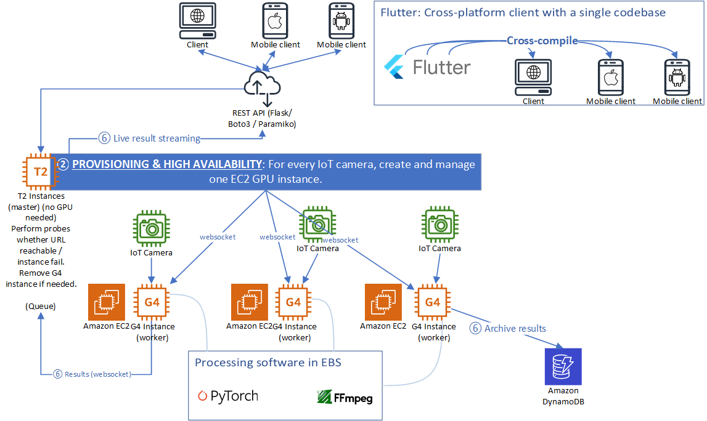

# Cloud Computing Project
**DRAFT**

<!--## Group members-->

## Objective
We are writing a lightweight cloud storage deduplication program. *Research problems* like scalability, deduplication granularity, the usefulness of deduplication, and security will be addressed.

DynamoDB is used to store the key-value pairs of `<block id; binary content>`, `<file id; user id, file path, file sequence, metadata>`, `<user id; hash, salt, first name, last name>`

The front end is written in Flutter, so that it can be used on mobile devices. The back end is an API powered by Flask.

Amazon EC2 instances are created on demand using the Boto3 library, depending on the input data size. TCP socket programming is used as the means of communication between EC2 Nodes.

## Test cases

Some large files (~ 10 GB) will be prepared.

## 0. Ideas
Cloud storage / cloud backup: handling unstructured data

Deduplication is a trade-off between user's storage size and file reassembly time.

Points to consider:
* What the optimal block size is (a.k.a. granularity)
* How much latency is needed to reassemble the files
* How to store the blocks in the database without security implications
### a. On-demand deduplication
Elasticity in Cloud Computing. Deduplicate when the user's storage is nearly full, exchange for longer reassembly time. In another scenario: small local cloud storage providers that do not have large data centres. They can save the cost to buy new hardware.
### b. Distributed Data Deduplication

## 1. Algorithms
* a. AES

Block size is fixed to be 128 b. More insecure.

* b. Rabin fingerprinting

From Wikipedia:
The basic idea is that the filesystem computes the cryptographic hash of each block in a file. To save on transfers between the client and server, they compare their checksums and only transfer blocks whose checksums differ. But one problem with this scheme is that a single insertion at the beginning of the file will cause every checksum to change if fixed-sized (e.g. 4 KB) blocks are used. So the idea is to select blocks not based on a specific offset but rather by some property of the block contents. LBFS does this by sliding a 48 byte window over the file and computing the Rabin fingerprint of each window. When the low 13 bits of the fingerprint are zero LBFS calls those 48 bytes a breakpoint and ends the current block and begins a new one. Since the output of Rabin fingerprints are pseudo-random the probability of any given 48 bytes being a breakpoint is {\displaystyle 2^{-13}}2^{{-13}} (1 in 8192). This has the effect of **shift-resistant variable size blocks**. Any hash function could be used to divide a long file into blocks (as long as a cryptographic hash function is then used to find the checksum of each block): but the Rabin fingerprint is an efficient rolling hash, since the computation of the Rabin fingerprint of region B can reuse some of the computation of the Rabin fingerprint of region A when regions A and B overlap.

Note that this is a problem similar to that faced by rsync.

## 2. Case Studies

* Marcus, E., & Carl-Henrik, E. (2014). *Deduplication as an Attack Vector*. Retrieved February 24, 2022, from https://www.ida.liu.se/~TDDD17/oldprojects/2014/Covert%20channels%20in%20the%20cloud/TDDD17_Project_report_marei265_carer706.pdf 

* Dropbox Security Breach due to loophole in Deduplication algorithm:

  - [https://github.com/driverdan/dropship](https://github.com/driverdan/dropship)
  - [https://blog.fosketts.net/2011/07/11/dropbox-data-format-deduplication/](https://blog.fosketts.net/2011/07/11/dropbox-data-format-deduplication/)
  - [https://news.ycombinator.com/item?id=2478567](https://news.ycombinator.com/item?id=2478567)
The algorithm must be designed with special care to avoid birthday attacks:
https://en.wikipedia.org/wiki/Birthday_attack

* StorReduce on Amazon

https://www.google.com/search?q=commvault+deduplication&oq=commvault+deduplication&aqs=chrome..69i57j0i512l2j0i30l7.9405j0j7&sourceid=chrome&ie=UTF-8

## References

<!-- Grid computing: needs to stop other instances once the solution is found. -->

