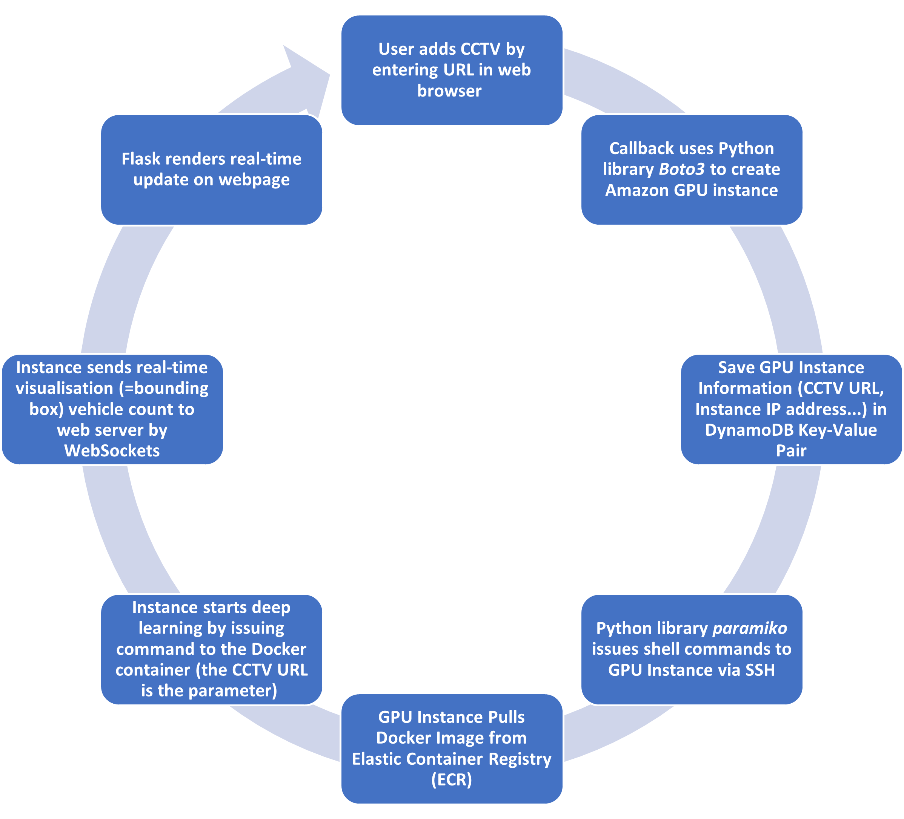
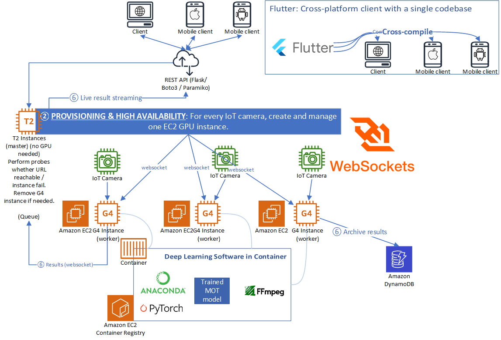

# Cloud Computing Project

## Scalable and Compatible Real-time IoT Graphics Deep Learning for Traffic Analysis using Cloud Computing 
**Group 8**

### Demo video: https://www.youtube.com/watch?v=Pn3P5l0gSSE

## Group members
56200477 Poon Bing-chun

56778411 YANG Yinze

56767955 Wu Yidu

55628042 Li Ka Faat

## Demo Website
Future site: [https://dord.mynetgear.com:18888](https://dord.mynetgear.com:18888)

## Project Website
* [Docker Container](https://dord.mynetgear.com:14443/container.tar) (this is the uncompressed version: ~21 GB; version on ECR is compressed: ~12 GB), the Docker container should be attached to a cloud compute instance, see the requirements below.

`conda run -n my-env python demo/demo_mot_vis.py configs/mot/tracktor/my2.py --input "testsuite/unknown_02.mp4" --output "/tbd" --fps 5`

* GitHub: [https://github.com/SoftFeta/CloudProject](https://github.com/SoftFeta/CloudProject)

## Summary of our System's Pipeline


## Objectives
We are doing a **research topic**.

There are quite a few works that tackle real-time computer vision computations on the cloud, like object detection, semantic segmentation and collision avoidance. For example, the paper by Liu and Boehm [1] uses Apache Spark and Amazon EC2 to achieve point cloud classification. However, some **critical research issues** are often neglected. For example, the mentioned does not address the issue of fairness. A bad scenario would be, the live vehicle counts of some CCTVs are not updating because they do not get the fair share. The other extreme would be a deadlock, the master keeps waiting for a CCTV to respond.

Scalability would be another issue. As the system network keeps expanding, some suboptimal cloud systems need a lot of hardwiring or manual configuration. For example, a bad system relies on creating EC2 instance, security groups etc by clicking on the AWS web panels.

For some papers, their *orchestration* methods are either omitted or neglected. For example if the live stream is not reachable after how many minutes, the EC2 should be shut down. Mishandling this important cloud computing concept may lead to coordination problems, or waste of resource (and money). Borrowed from Kubenetes parlance, orchestration includes performing liveliness tests and readiness tests.

## Implementation
Thus, we are building an alternative system for traffic analysis that is lightweight and scalable. In a nutshell, the user can add or remove URLs of CCTV live streams (\*.m3u8) to the application. Therefore, it should even be compatible with YouTube streams. Once such URL is added, a new Amazon EC2 instance will be created to do object detection. Then the real-time vehicle count will be collected and visualized. Instead of the sequential pipeline like the Liu/Boehm paper, we will use the subscriber model (socket programming) to communicate between EC2 instances.

The m3u8 format is standard for video streaming, you can get the URLs by Chrome F12 > Network tab > Search 'm3u8':
* https://www.hkemobility.gov.hk/en/traffic-information/live/webcast 
* http://www32.ha.org.hk/capitalworksprojects/en/Project/10years/United-Christian-Hospital/Introduction.html

YouTube videos are easy to convert to m3u8 (Japan):
* https://www.youtube.com/watch?v=-0RZ0K984nA

We have trained a *multiple object tracking (MOT)* deep learning model based on Tracktor and ResNet-101 on eight types of vehicles. As long as the cameras are in a nadir position (perpendicular to the horizon), or in other words, not too oblique, the same model can be reused. The greatest advantage of MOT over object detection is that it is resilient to both partial and total occlusion.

Each CCTV subscribes to the master. Once a CCTV is removed, then the EC2 instance will be terminated, it unsubscribes from the subscriber model. Real use cases include the user adding a URL once new CCTV has been installed, a EC2 instance will be provisioned; a CCTV enters maintenance mode (unreachable), or alternatively, for energy-conserving purpose its operation hours are limited, the EC2 instance disconnects and terminates.

### Preliminary architecture design
Note that the design is subject to change. The subscriber model is implemented using websockets.

An advantage of using cloud computing for deep learning is, if we have multiple deep learning models, we can harness multiple EC2 instances to perform model blending or model stacking, improving the accuracy of the object tracking, without loss of computing performance. 



## Technologies used
We will implement everything in basic Python, HTML and JavaScript. We can programmatically create EC2 instances using the **Boto3** library, which is the official Python client for everything AWS, made by Amazon themselves. Commands can be issued programmatically using the **paramiko** library, which is basically a SSH (Secure Shell) wrapper.

If we have extra time, we can implement a cross-platform front end using Flutter, which compiles to Android, iOS, Linux, web and more.

## IMPORTANT
**To use the AWS Client Library boto3, you should have [AWS Command Line Interface](https://aws.amazon.com/cli/) installed (for security purposes) and run**
```
aws configure
```
**to [log into your account](https://docs.aws.amazon.com/cli/latest/userguide/cli-configure-quickstart.html).**

## Requirements
To install the dependencies, enter the following in the command line:
```
cd code
pip3 install -r requirements.txt
```

## Bibliography
[1] Liu, K., & Boehm, J. (2015). *Classification of Big Point Cloud Data Using Cloud Computing*. ISPRS-International Archives of the Photogrammetry, Remote Sensing and Spatial Information Sciences 40, 553-557. Retrieved February 24, 2022, from https://discovery.ucl.ac.uk/id/eprint/1471584/1/isprsarchives-XL-3-W3-553-2015.pdf 

[2] Bergmann, P., Meinhardt, T., & Leal-Taixe, L. (2019, August 17). *Tracking without bells and whistles*. arXiv.org. Retrieved February 24, 2022, from https://arxiv.org/abs/1903.05625 

[3] Luckow, A., Cook, M., Ashcraft, N., & Weill, E. (2016, December). *Deep Learning in the Automotive Industry: Applications and Tools*. Retrieved February 24, 2022, from https://www.researchgate.net/profile/Andre-Luckow/publication/313458531_Deep_Learning_in_the_Automotive_Industry_Applications_and_Tools/links/5a6e84c3458515d407585438/Deep-Learning-in-the-Automotive-Industry-Applications-and-Tools.pdf 

[4] Eva Maia Malta University of Campinas, Malta, E. M., Campinas, U. of, Campinas, S. A. U. of, Avila, S., Campinas, E. B. U. of, Borin, E., Technology, A. U. of, Sciences, Z. U. of A., Cesnet, Derby, U. of, & Metrics, O. M. V. A. (2019, December 1). *Exploring the cost-benefit of AWS EC2 GPU instances for Deep Learning Applications: Proceedings of the 12th IEEE/ACM International Conference on Utility and Cloud Computing*. ACM Conferences. Retrieved February 26, 2022, from https://dl.acm.org/doi/abs/10.1145/3344341.3368814 
