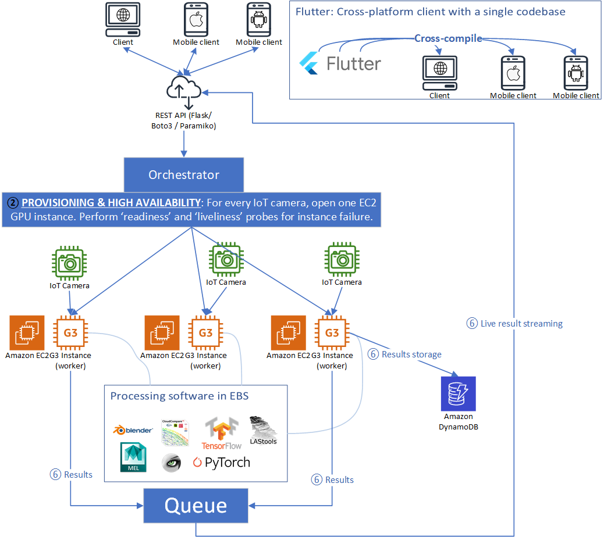
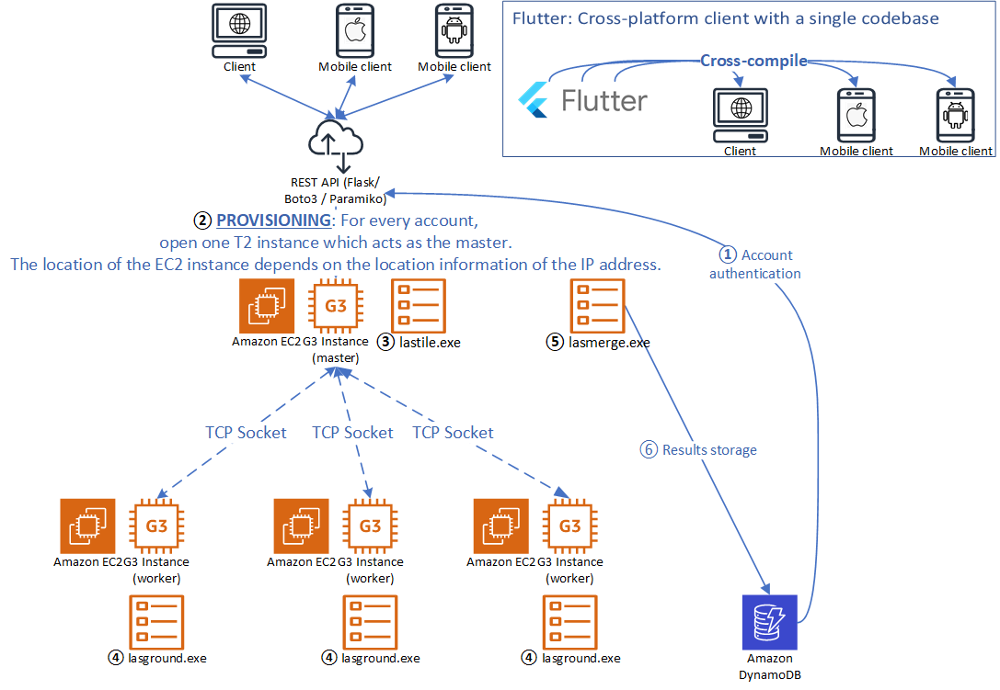

# Cloud Computing Project
**DRAFT**

<!--## Group members-->

## Objective
We are writing a lightweight cloud storage deduplication program. *Research problems* like scalability, deduplication granularity, the usefulness of deduplication, and security will be addressed.

DynamoDB is used to store the key-value pairs of `<block id; binary content>`, `<file id; user id, file path, file sequence, metadata>`, `<user id; hash, salt, first name, last name>`

The front end is written in Flutter, so that it can be used on mobile devices. The back end is an API powered by Flask.

Amazon EC2 instances are created on demand using the Boto3 library, depending on the input data size. TCP socket programming is used as the means of communication between EC2 Nodes.

## Test cases

Some large files (~ 10 GB) will be prepared.

## 0. Ideas
Cloud storage / cloud backup: handling unstructured data

Deduplication is a trade-off between user's storage size and file reassembly time.

Points to consider:
* What the optimal block size is (a.k.a. granularity)
* How much latency is needed to reassemble the files
* How to store the blocks in the database without security implications
### a. On-demand deduplication
Elasticity in Cloud Computing. Deduplicate when the user's storage is nearly full, exchange for longer reassembly time. In another scenario: small local cloud storage providers that do not have large data centres. They can save the cost to buy new hardware.
### b. Distributed Data Deduplication

## 1. Algorithms
* a. AES

Block size is fixed to be 128 bit, which makes cloud storage/backup insecure. By observing which blocks are actually uploaded and which blocks are not, the attacker may infer the file structure.

* b. Rabin fingerprinting

From Wikipedia:
The basic idea is that the filesystem computes the cryptographic hash of each block in a file. To save on transfers between the client and server, they compare their checksums and only transfer blocks whose checksums differ. But one problem with this scheme is that a single insertion at the beginning of the file will cause every checksum to change if fixed-sized (e.g. 4 KB) blocks are used. So the idea is to select blocks not based on a specific offset but rather by some property of the block contents.

LBFS does this by sliding a 48 byte window over the file and computing the Rabin fingerprint of each window. When the low 13 bits of the fingerprint are zero LBFS calls those 48 bytes a breakpoint and ends the current block and begins a new one. Since the output of Rabin fingerprints are pseudo-random the probability of any given 48 bytes being a breakpoint is {\displaystyle 2^{-13}}2^{{-13}} (1 in 8192). This has the effect of **shift-resistant variable size blocks**. Any hash function could be used to divide a long file into blocks (as long as a cryptographic hash function is then used to find the checksum of each block): but the Rabin fingerprint is an efficient rolling hash, since the computation of the Rabin fingerprint of region B can reuse some of the computation of the Rabin fingerprint of region A when regions A and B overlap. This is a problem similar to that faced by rsync.

## 2. Case Studies

* Marcus, E., & Carl-Henrik, E. (2014). *Deduplication as an Attack Vector*. Retrieved February 24, 2022, from https://www.ida.liu.se/~TDDD17/oldprojects/2014/Covert%20channels%20in%20the%20cloud/TDDD17_Project_report_marei265_carer706.pdf 

* Dropbox Security Breach due to loophole in Deduplication algorithm:

  - [https://github.com/driverdan/dropship](https://github.com/driverdan/dropship)
  - [https://blog.fosketts.net/2011/07/11/dropbox-data-format-deduplication/](https://blog.fosketts.net/2011/07/11/dropbox-data-format-deduplication/)
  - [https://news.ycombinator.com/item?id=2478567](https://news.ycombinator.com/item?id=2478567)
The algorithm must be designed with special care to avoid birthday attacks:
https://en.wikipedia.org/wiki/Birthday_attack
* CommVault / AWS Glacier
* StorReduce on Amazon

## References

<!-- Grid computing: needs to stop other instances once the solution is found. -->

----------------------------------------
----------------------------------------
----------------------------------------
----------------------------------------

# Review of *Classification of Big Point Cloud Data Using Cloud Computing (Liu, Boehm 2015)*

## Introduction

Todo: Multiple masters Visio...

Among web applications architures, the traditional monolithic model is obsolete. The upper bound for performance gain is lower scaling up than scaling out in the cloud, suffers from high coupling, services may have common sources of failure, and not cost-effective. 

A network of loosely coupled microservices. There is a tendancy to even break down microservices into nanoservices. For instance, dataset augmentation can be defined as one nanoservice. A prominent example is Amazon Lambda, which is named after lambda functions.

Machine learning like processing computer graphics (CG) data is becoming more and more challenging due to the growing data volume. In this paper, we address point data classification in a big data context. The popular cluster computing framework Apache Spark is used through the experiments and the promising results suggests a great potential of Apache Spark for large-scale point data processing.

The architecture lacks granularity: a modern cloud application is usually laid out as a network of micro(/nano)services. For example, data augmentation can be one microservice in the pipeline.

Spark error handling...

Timeliness is a critical factor for many use cases of CG processing.
To address possible scalability issues in that work, two alternative architectures for CG processing using Amazon EC2 instances are presented. Simple benchmarking has been done to test the efficiency of these cloud architectures.

-------------------------------------------------------------
## Summary of the Work
TODO

## Alternative architectures
#### IoT Example
Nadir cameras (RGB or LiDAR) like the image below [Fairbanks_Circle.png]. Smart City lampposts. Scale out G5 GPU EC2 instances. Stream of images. May need ZeroMQ or MQTT installed in the master node to ensure the fairness of each camera...

-------------------------------------------------------------
Training new models is faster on a GPU instance than a CPU instance. You can scale sub-linearly when you have multi-GPU instances or if you use distributed training across many instances with GPUs.

The AWS Deep Learning AMI (DLAMI) comes preconfigured with NVIDIA CUDA and NVIDIA cuDNN, as well as the latest releases of the most popular deep learning frameworks.
* Amazon EC2 P3 Instances have up to 8 NVIDIA Tesla V100 GPUs.
* Amazon EC2 P4 Instances have up to 8 NVIDIA Tesla A100 GPUs.
* Amazon EC2 G3 Instances have up to 4 NVIDIA Tesla M60 GPUs.
* Amazon EC2 G4 Instances have up to 4 NVIDIA T4 GPUs.
* Amazon EC2 G5 Instances have up to 8 NVIDIA A10G GPUs.
* Amazon EC2 G5g Instances have Arm-based AWS Graviton2 processors.

#### Computer graphics processing pipeline in the cloud using EC2 and Apache Airflow

#### Preamble
We can programmatically create EC2 instances using the Boto3 library. Commands can be issued programmatically using the paramiko library, which is basically a SSH (Secure Shell) wrapper.
Apache Airflow is a local program. Its use is to orchestrate the EC2 instances. Specifically, we define an Airflow task as some SSH commands to the EC2 instances. Those Airflow tasks are linked together by a direct acyclic graph (DAG).

WebSocket for communication

Computer graphics include bitmap images, vector images, 3D meshes, and 3D point clouds.

#### Rationale for Using Cloud Computing
Besides cloud storage, cloud computing is particularly useful for deep learning. Procedures in the pipeline, including smoothing, baking and rendering, are resource-hungry and time-consuming process.

Many reasons: 
(Multitenancy) There may be multiple users that upload their CG files for processing.

users do not need to install software since the web browser can access it, allows multiple concurrent users without degrading performance too much, users do not need to have actual access to expensive hardware, allows sharing and collaboration, good for logging etc. High availability, scale with resources. As with any cloud pipelines, it is also good for commercialisation, you can accept multiple payment methods.
Sharing and. Archive and store results are done more easily: Traffic cameras from CCTVs. You know, the backgrounds of CCTV frames are nearly identical, the cloud can deduplicate the images to save space. It's easier to add more CCTVs on the cloud. Shared deduplication database.

Without the cloud, it is very difficult to scale when the number of CCTV increases. Task queues like Celery does not provide more or improve hardware, and therefore scale poorly.

Scale out on demand: it is quite parallel

Scale up on demand: VRAM is crucial in deep learning, OOM (out-of-memory) error. the clouds orchestrator can give more VRAM to nodes

Duplicate EBS:

#### Example 1: Image Detection on CCTV Frames for Traffic Analysis

This is a stream
Easy to scale, deploy more instances

Adding a CCTV is embarassingly parallel.

As the number of CCTVs increases, the number of repeated pixel sequence sharply increases. We can use run-length encoding and LZ77.

-----------
Divide and conquer is good
#### Example 2: Point Cloud Classification Server

In fact, the open data Point Cloud from CEDD for the entire Hong Kong is 100TB large. 0.5 km^2 tiles

Sort the point cloud by coordinates so that it can be split into tiles. It can be parallelized using merge sort for MapReduce in Hadoop or Spark.

Tile and distribute to all
Each node perform classfications
merge results (can be recursive!)

Ubuntu Visio!!!

Compare to Amazon Lambda, a serverless service offered by AWS. It is very hard if not possible to execute external programs. EC2 is easier to do this. 3 sample programs lastiles.exe, lasground.exe, and lasmerge.exe
and do benchmark using Python time.time(), compare to lasground on a single instance.

#### Master/worker Model

Duplicate EBS that contains scripts and software like Blender, CompareCloud, Maya and MeshLab. We can manipulate the abovementioned software using their scripting capabilities. We do not need graphical interface to use these software, since it supports languages like MEL and Python.

Visio!!!!!!!!

Merge models on the master node.

We can define at least 10 nanoservices

Nanoservice models. Similar nanoservices
How about class inheritance in nanoservices?

Kubeflow. Kubenetes is good for very large projects, but there are too many components. Besides, the person needs to have an in-depth knowledge of technologies like Docker, remote procedure call and YAML configuration files. It has a very steep learning curve.

A nanoservice is just a function. It can have a output value that pass to the next nanoservice in the pipeline, or a execution result code either to indicate the operation is successful, or the error type for the pipeline to do corresponding actions if unsuccessful.

Apache Airflow, is an orchestration service AirBNB. It has a hard restriction that the workflow be a direct acyclic graph, therefore no cycles is allowed. Comparing DAG to a generic graph, sometimes we need to execute a nanoservices multiple times, but disallowing loops is actually a good design. It avoids stuck in an infinite loop (e.g. deadlocks caused by waiting of resources, or programming faults). Besides, it makes the flow more readable and understandable as it avoid clumping (less edges).

Comparing DAG to the traditional sequential pipeline, a DAG allows sharing of nodes (multiple edges pointing towards or emanating from a common microservice), enhancing the reusability.

Apache Storm

Break down into nanoservices:
1. Determine and allocate on-demand computing resources by the input dataset size
2. Break down (tile) the dataset if it is too large

The same applies to point cloud, images, etc

## Bibliography

* Liu, K., & Boehm, J. (2015). *Classification of Big Point Cloud Data Using Cloud Computing*. ISPRS-International Archives of the Photogrammetry, Remote Sensing and Spatial Information Sciences 40, 553-557. Retrieved February 24, 2022, from https://discovery.ucl.ac.uk/id/eprint/1471584/1/isprsarchives-XL-3-W3-553-2015.pdf 
